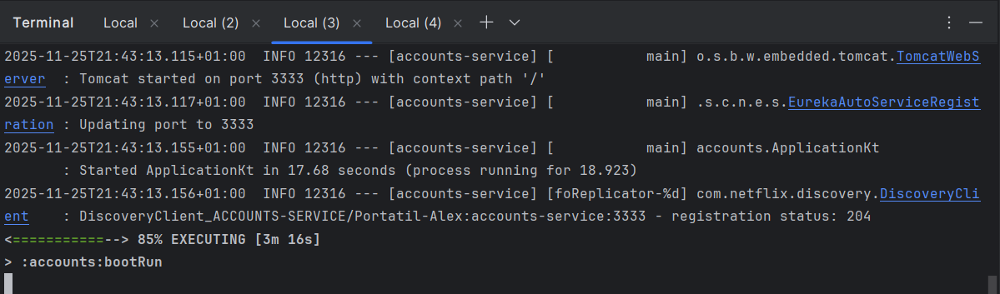
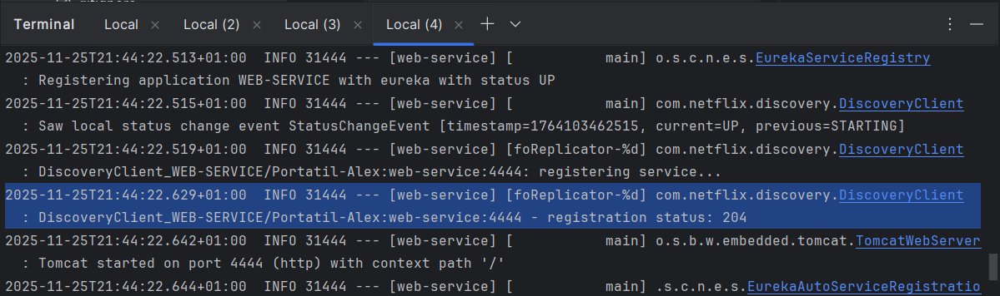
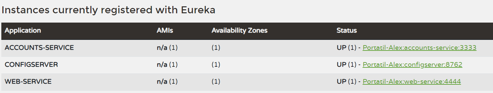
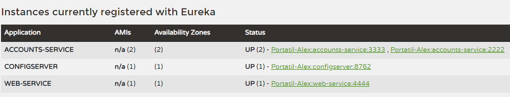
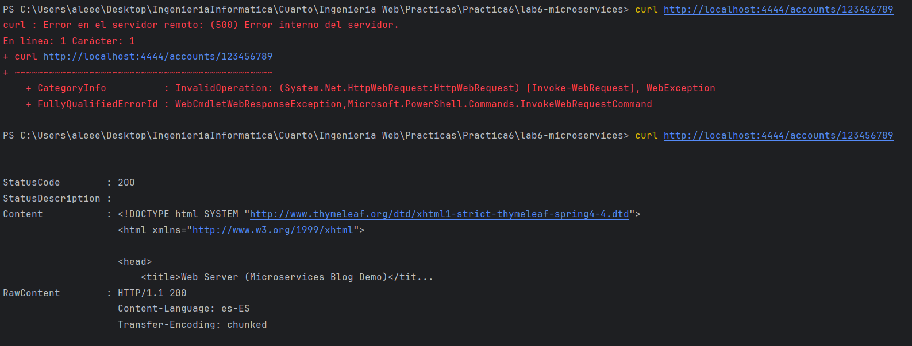
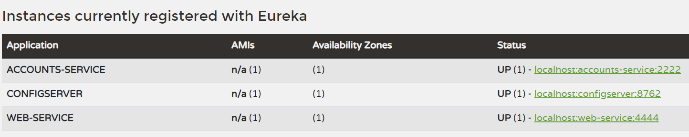
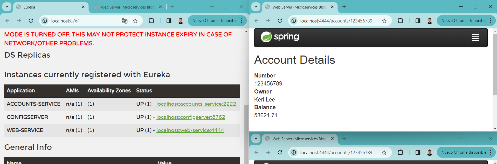

# Lab 6 Microservices - Project Report

## 1. Configuration Setup

**Configuration Repository**: [[Link to your forked repository](https://github.com/874113/lab6-microservices)]

En el archivo `accounts-service.yml`, modifiqué principalmente el puerto en el que se ejecuta el servicio de cuentas, estableciéndolo en el puerto 2222 para crear un nuevo servicio de cuentas adicional, asegurándome de que no entrara en conflicto con la instancia original que corre en el puerto 3333.

La configuración externalizada es esencial en microservicios porque permite cambiar parámetros (puertos, credenciales, etc) sin recompilar el código, facilita tener diferentes configuraciones, mejora la seguridad al separar secretos del código fuente, y permite que múltiples instancias compartan una configuración centralizada. Esto proporciona flexibilidad, mantenibilidad y escalabilidad sin intervención manual en cada despliegue.

---

## 2. Service Registration (Task 1)

### Accounts Service Registration



Durante el inicio del servicio de cuentas, ocurren los siguientes eventos clave:

1. **Inicialización de Eureka**: El cliente DiscoveryClient se inicializa en la región `us-east-1`.

2. **Conexión al servidor Eureka**: El servicio establece conexión con el servidor Eureka y consulta el registro de servicios disponibles. Recibe el registro del Discovery Server y otros servicios ya registrados.

3. **Heartbeat y registro**: El DiscoveryClient comienza a enviar heartbeats cada 30 segundos mediante el executor de renovación.

4. **Cambio de estado**: El estado inicial cambia de `STARTING` a `UP`, indicando que el servicio está listo para recibir tráfico.

5. **Registro exitoso**: El registro se completa exitosamente con el código de estado HTTP 204 (No Content).

6. **Puerto de escucha**: El servicio inicia Tomcat en el puerto 3333, permitiendo conexiones entrantes.

Este proceso garantiza que el servicio se da a conocer al servidor de descubrimiento centralizado, permitiendo que otros servicios lo encuentren de manera dinámica.

### Web Service Registration



El servicio web realiza un proceso de descubrimiento similar pero con detalles importantes:

1. **Obtención de la configuración**: El servicio web se conecta al servidor de configuración en y obtiene la configuración para `web-service`.

2. **Consulta del registro de Eureka**: El DiscoveryClient consulta el servidor Eureka para obtener todas las instancias registradas.

3. **Descubrimiento de servicios existentes**: La consulta al registro regresa exitosamente (código 200) con `initial instances count: 2`. Esto indica que el servicio web descubre:
   - El servidor de configuración (discovery/config server)
   - El servicio de cuentas (`ACCOUNTS-SERVICE`) ya registrado en el puerto 3333

4. **Registro del servicio web**: El servicio web se registra a sí mismo como `DiscoveryClient_WEB-SERVICE/Portatil-Alex:web-service:4444` en el puerto 4444.

Este mecanismo demuestra cómo los microservicios descubren automáticamente sus dependencias mediante un registro centralizado, eliminando la necesidad de configuración hardcodeada de URLs.

---

## 3. Eureka Dashboard (Task 2)



En el dashboard de Eureka se muestra el servidor de configuración, y los 2 servicios, tanto el de Accounts como el de Web.

Para cada instancia del dashboard muestra las zonas en las que está disponible, el estado en el que se encuentra, el número de veces que esa instancia está registrada con ese estado, y una concatenación de host, nombre de servicio y puerto.

---

## 4. Multiple Instances (Task 4)



**¿Qué sucede cuando inicia una segunda instancia del servicio de cuentas?**

Cuando se inicia una segunda instancia del servicio de cuentas en el puerto 2222, ocurren los siguientes pasos:

1. **Inicialización independiente**: La segunda instancia sigue el mismo proceso de inicialización que la primera, conectándose al servidor de configuración y obteniendo su configuración remota.

2. **Consulta del registro**: Al inicializar la nueva instancia, consulta el servidor Eureka y recibe un conteo inicial de instancias de `initial instances count: 3` (Config Server, Web Service, y la primera instancia de Accounts Service).

3. **Registro automático**: La nueva instancia se registra con el nombre `DiscoveryClient_ACCOUNTS-SERVICE/Portatil-Alex:accounts-service:2222` y recibe el código de estado HTTP 204 (exitoso).

4. **Ambas instancias activas**: Después del registro, el dashboard de Eureka muestra:
   ```
   ACCOUNTS-SERVICE - UP (2)
   - Portatil-Alex:accounts-service:3333
   - Portatil-Alex:accounts-service:2222
   ```

**¿Cómo maneja Eureka múltiples instancias?**

Eureka mantiene un registro centralizado de todas las instancias del mismo servicio, agrupándolas bajo el mismo nombre de aplicación (`ACCOUNTS-SERVICE`) y posteriormente bajo cada estado. El dashboard muestra:
- El estado de cada grupo de instancias: `UP`
- El número total de instancias de ese grupo: `(2)` 
- La lista individual de cada instancia con su host, nombre de servicio y puerto

Eureka también realiza heartbeats periódicos (cada 30 segundos) para verificar que ambas instancias sigan activas y disponibles.

**¿Cómo funciona el balanceo de carga del lado del cliente con múltiples instancias?**

El servicio web, mediante el cliente `RestTemplate` con `LoadBalancer`, implementa balanceo de carga del lado del cliente:

1. Cuando el web service necesita llamar a `ACCOUNTS-SERVICE`, el LoadBalancer consulta el registro de Eureka y obtiene la lista de 2 instancias disponibles (puertos 3333 y 2222).

2. El LoadBalancer implementa una estrategia de round-robin por defecto, distribuyendo las solicitudes alternando entre las instancias disponibles.

3. El LoadBalancer mantiene caché local de las instancias disponibles, lo que permite responder rápidamente a las solicitudes sin consultar Eureka cada vez.

---

## 5. Service Failure Analysis (Task 5)

### Initial Failure



Tras parar el servicio de cuentas del puerto 3333 y realizar varias peticiones, algunas dan error en el servidor remoto y otras responden correctamente. Esto se debe a que el LoadBalancer del cliente web aún tiene en caché ambas instancias (3333 y 2222). Sin embargo, al intentar acceder a la instancia caída (3333), se produce un error de conexión.

### Eureka Instance Removal



Por su parte, el servicio web logra recuperarse a los 3-4 minutos, ya que el LoadBalancer detecta que la instancia en el puerto 3333 no responde y la elimina de su caché local. A partir de ese momento, todas las solicitudes se dirigen únicamente a la instancia activa en el puerto 2222, evitando más errores.

Eureka utiliza un mecanismo de heartbeats para monitorear la salud de las instancias registradas. Cada instancia envía un heartbeat cada pocos segundos, de forma que si una instancia no envía un heartbeat dentro de ese período de tiempo, Eureka la marca como "DOWN" y la elimina del registro.

---

## 6. Service Recovery Analysis (Task 6)



El servicio web se recupera porque el LoadBalancer del cliente detecta que la instancia caída (puerto 3333) ya no está disponible y la elimina de su caché local. Esto permite que todas las solicitudes futuras se dirijan únicamente a la instancia activa (puerto 2222), evitando errores de conexión.

La recuperación tomó aproximadamente entre 3 a 4 minutos. Durante este tiempo, el LoadBalancer intentó acceder a ambas instancias, pero al no recibir respuesta de la instancia caída, la eliminó de su caché.

La cache del lado del cliente juega un papel crucial en el proceso de recuperación, ya que permite al LoadBalancer mantener una lista actualizada de las instancias disponibles. Al eliminar la instancia no funcional de la caché, el LoadBalancer puede redirigir las solicitudes a las instancias activas, asegurando la continuidad del servicio sin interrupciones significativas.

---

## 7. Conclusions

Sobre la arquitectura de los microservicios he aprendido principalmente sobre su comportamiento en entornos distribuidos, remarcando que la separación en servicios independientes favorezca la escalabilidad de cada servicio y la facilidad para gestionar fallos sin comprometer todo el sistema.

Al usar Eureka como servicio de discovery pude comprender como los servicios se registran dinámicamente, facilitando la comunicación entre servicios y posibilitando la existencia de balanceadores de carga del lado del cliente que permiten distribuir las solicitudes entre instancias del mismo servicio. Además, apreciamos como Eureka mantiene un registro mediante heartbeats de las instancias activas, eliminando las caídas tras un tiempo.

También comprendí cómo el propio sistema puede recuperarse de fallos de forma autónoma, detectando fallos y eliminando instancias fallidas. Volviendo a operar de forma normal tras errores con las instancias verdaderamente activas.

Durante el desarrollo de la práctica encontré algún problema que pude solucionar. El principal problema surgió cuando en la Task 6, el dashboard no se actualizaba correctamente, y el sistema no se reestablecía correctamente, ya que seguía enviando peticiones a la instancia fallida. Por lo que tras hablar del tema con un par de compañeros que se encontraban en la misma situación, pudimos solucionarlo modificando el archivo `discovery/src/main/resources/application.yml`, añadiendo en server la linea "enable-self-preservation: false".

---

## 8. AI Disclosure

**Did you use AI tools?** (ChatGPT, Copilot, Claude, etc.)

Si he usado IA, principalmente Claude. El uso que le he dado ha sido principalmente ayudarme a revisar los logs de los servicios lanzados para verificar que no me saltaba ningún detalle importante de los procesos que realizaban. Y por otra parte, asegurarme de que comprendo todos los aspectos del comportamiento de los servicios, como es el caso de la task 1, en la que me he querido cerciorar de comprender correctamente como el servicio web descubría el servicio de cuentas, o en la task 4 sobre como funciona correctamente el balanceador de carga .

---

## Additional Notes

Any other observations or comments about the assignment.

